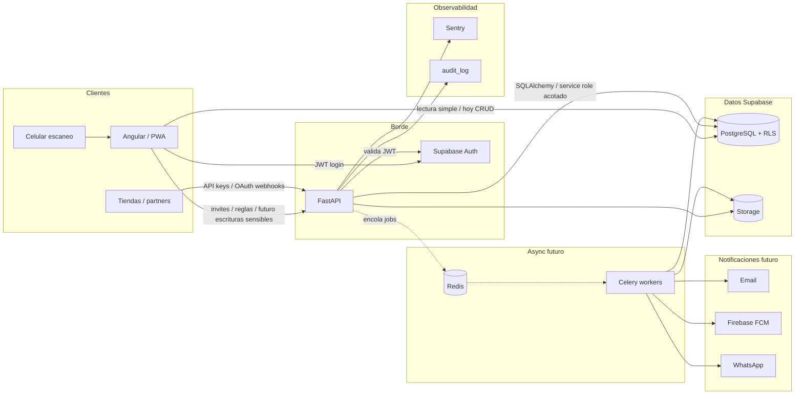

# Stock Viewer — arquitectura (hoy + futuro)

Complemento del esquema DBML: [`stock-viewer.dbml`](./stock-viewer.dbml)  
Abrí el `.dbml` en [dbdiagram.io](https://dbdiagram.io) (Import → From DBML).  
Este archivo conviene dibujarlo también en [diagrams.net](https://app.diagrams.net) si querés exportar PNG.

## Capas y tecnologías

| Capa | Hoy | Próximo | Futuro |
|------|-----|---------|--------|
| Front | Angular | Angular (+ pantalla Equipo) | PWA, ApexCharts, escaneo cámara |
| API | Cliente Supabase directo | **FastAPI** (invites, miembros, reglas) | API pública, webhooks integraciones |
| Auth | Supabase Auth (JWT) | Igual; FastAPI valida JWT | API keys para partners |
| BD | Supabase PostgreSQL + RLS | + `company_invites`, `audit_log` | sucursales, alertas, forecasts |
| Archivos | — | — | Supabase Storage |
| Cache / colas | — | — | Redis + Celery |
| Notifs | — | Email (invite) | Firebase + Email + WhatsApp |
| Observabilidad | — | Sentry | Sentry + `audit_log` |
| Contenedores | — | Docker (API) | Docker Compose (API + Redis + worker) |
| Reportes | Vistas SQL en app | — | WeasyPrint + openpyxl |
| Código barras | — | — | pyzbar / python-barcode |

## Diagrama de comunicación (Mermaid)

Podés pegarlo en cualquier visor Mermaid (GitHub, Notion, etc.).

## Flujos de gestión (orden sugerido)

1. **Hoy:** usuario crea empresa → `create_company` → es `owner` → gestiona productos/movimientos.
2. **Próximo:** owner/admin invita email → fila `company_invites` → mail con link → acepta → `company_members` → ve el mismo stock (RLS).
3. **Futuro:** alertas (Celery) → `notifications` → canales; reportes → `report_jobs` → Storage; sync ecommerce → `integration_connections`.

## Nota importante

No implementes Redis/Celery/Firebase/WhatsApp hasta que el flujo de **miembros + invitaciones** esté en producción. El DBML marca `[FUTURO]` para diseñar sin obligarte a migrar todo ya.
